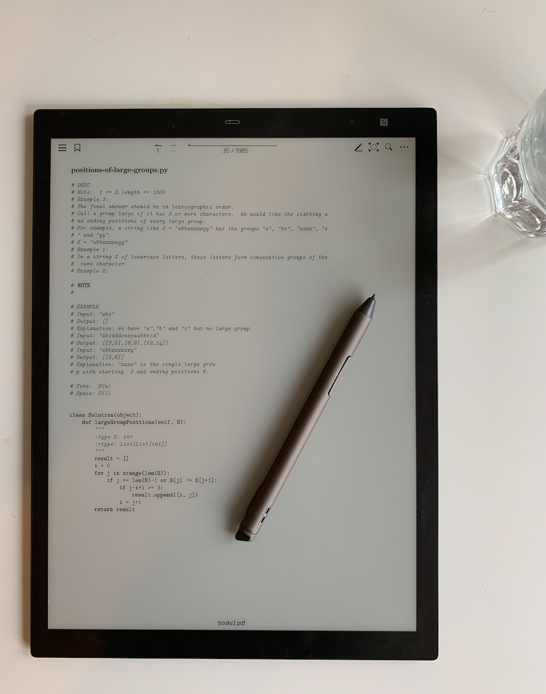

# leetcode-book

Well, there are many repos on leetcode solutions but I personally prefer reading them on [Sony DPT](https://www.amazon.com/Sony-DPT-RP1-13-Digital-Paper/dp/B072DXXXN1).    

So here is descriptions and solutions to all leetcode problems in python in a single 1985-page pdf.

The original solution is obtained from [here](https://github.com/kamyu104/LeetCode-Solutions). If you find this helpful, please consider star the repo. I will gradually improve it (add difficult level, fix missing descriptions, etc) if people likes this. 

